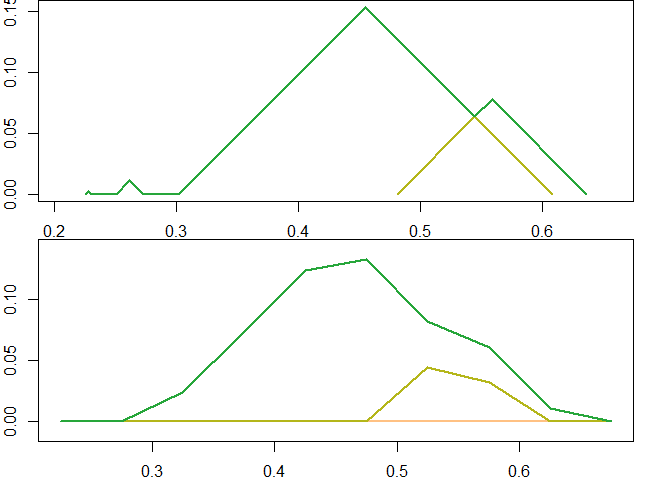

<!-- README.md is generated from README.rmd. Please edit that file -->

# plt

Persistence landscapes are a vectorization of persistence data/diagrams
that have useful statistical properties including linearity and an inner
product.[^1] This is an R package interface to a C++ library to
efficienctly compute and calculate with persistence landscapes.[^2]

## Installation

Until the package is on CRAN, use **pak** to install the package from
the GitHub repository as follows:

``` r
install.packages("pak")
pak::install_github("corybrunson/plt", build_vignettes = TRUE)
```

Alternatively—and especially if you want to contribute—you can clone or
download the code repository and, from within the directory, install the
package from source:

``` r
devtools::install()
```

You should now be able to load the package normally from an R session:

``` r
library(plt)
```

## Quickstart Guide

The **plt** package supports various operations involving persistence
landscapes:

- Compute persistence landscapes from persistence data
- Perform Hilbert space operations (scaling, addition, inner product)
  plus some additional queries and transformations (extremal values,
  absolute value, integration) on persistence landscapes
- Plot persistence landscapes

Examples and tests in **plt** rely on other packages to simulate data
and to compute persistence diagrams from data:

- **tdaunif** provides functions to sample uniformly from various
  immersed manifolds.
- **ripserr** and **TDA** provide functions to compute persistence data
  from point clouds and distance matrices.

**plt** introduces the ‘Rcpp_PersistenceLandscape’ S4 class, which is
exposed using **Rcpp** from the underlying ‘PersistenceLandscape’ C++
class. Instances of this class can be created using `new()` but the
recommended way is to use `landscape()`. This function accepts either a
single matrix of persistence data or a specially formatted list with the
class `'persistence_diagram"`. The `$pairs` entry of the list is itself
a list, of a 2-column matrix of persistence pairs for each homological
degree from 0 (`$pairs[[1]]`) to the maximum degree calculated. The
generic converter `as_persistence()` includes methods for outputs from
`ripserr::vietoris_rips()` and from `TDA::*Diag()`; it operates under
the hood of \`landscape(), but we invoke it explicitly here for
illustration.

### Calculation

To begin an illustration, we noisily sample 60 points from a figure
eight and compute the persistence diagram of the point cloud:

``` r
set.seed(513611L)
pc <- tdaunif::sample_lemniscate_gerono(60, sd = .1)
pd <- ripserr::vietoris_rips(pc, dim = 1, threshold = 2, p = 2)
#> Warning in vietoris_rips.matrix(pc, dim = 1, threshold = 2, p = 2): `dim`
#> parameter has been deprecated; use `max_dim` instead.
print(pd)
#> PHom object containing persistence data for 63 features.
#> 
#> Contains:
#> * 59 0-dim features
#> * 4 1-dim features
#> 
#> Radius/diameter: min = 0; max = 0.63582.
```

We the convert the persistence data to the preferred persistence diagram
format and inspect some of its features:

``` r
pd <- as_persistence(pd)
print(pd)
#> 'persistence' data computed up to degree 1:
#> 
#> * 0-degree features: 59
#> * 1-degree features:  4
print(head(pd$pairs[[1]]))
#>      [,1]       [,2]
#> [1,]    0 0.01918952
#> [2,]    0 0.01947548
#> [3,]    0 0.02604350
#> [4,]    0 0.04218479
#> [5,]    0 0.04542467
#> [6,]    0 0.05941691
print(head(pd$pairs[[2]]))
#>           [,1]      [,2]
#> [1,] 0.4809292 0.6358225
#> [2,] 0.3016234 0.6075172
#> [3,] 0.2504500 0.2727915
#> [4,] 0.2251884 0.2300871
```

This allows us to compute a persistence landscape—in this case, for the
1-dimensional features. Here we compute the landscape exactly, which can
be cost-prohibitive for larger persistence data:

``` r
pl1 <- landscape(pd, degree = 1, exact = TRUE)
print(pl1)
#> Persistence landscape (exact format) of 2 levels over (0,0.636)
```

### Class

The object `pl1` is not an array, but rather an object that encapsulates
both the data that encode a landscape and several basic operations that
can be performed on it. This allows us to work with persistence
landscapes without worrying about pre-processing their representations.
At any point, the underlying encoding of the landscape can be extracted
using `$getInternal()`, which in the case of an exactly calculated
landscape returns a list of 2-column matrices, each matrix containing
coordinates that define one level of the landscape as a piecewise linear
function:

``` r
print(length(pl1$getInternal()))
#> [1] 2
print(pl1$getInternal())
#> [[1]]
#>            [,1]        [,2]
#>  [1,]      -Inf 0.000000000
#>  [2,] 0.2251884 0.000000000
#>  [3,] 0.2276378 0.002449358
#>  [4,] 0.2300871 0.000000000
#>  [5,] 0.2504500 0.000000000
#>  [6,] 0.2616207 0.011170764
#>  [7,] 0.2727915 0.000000000
#>  [8,] 0.3016234 0.000000000
#>  [9,] 0.4545703 0.152946885
#> [10,] 0.5442232 0.063293964
#> [11,] 0.5583759 0.077446647
#> [12,] 0.6358225 0.000000000
#> [13,]       Inf 0.000000000
#> 
#> [[2]]
#>           [,1]       [,2]
#> [1,]      -Inf 0.00000000
#> [2,] 0.4809292 0.00000000
#> [3,] 0.5442232 0.06329396
#> [4,] 0.6075172 0.00000000
#> [5,]       Inf 0.00000000
```

An alternative, approximate construction computes the value of each
level of the landscape at each point on a 1-dimensional grid, ranging
from `xmin` to `xmax` at increments of `xby`. A landscape constructed
using a discrete approximation is stored as a 3-dimensional array of
dimensions (levels, values, 2), with one level per feature (some of
which may be trivial) and one value per grid point, stored as $x,y$
pairs along the third dimension.

``` r
b_ran <- pl_support(pl1)
pl1d <- landscape(pd, degree = 1,
                  xmin = b_ran[[1L]], xmax = b_ran[[2L]], xby = 0.05)
print(dim(pl1d$getInternal()))
#> [1] 4 9 2
print(pl1d$getInternal())
#> , , 1
#> 
#>           [,1]      [,2]      [,3]      [,4]      [,5]      [,6]      [,7]
#> [1,] 0.2251884 0.2751884 0.3251884 0.3751884 0.4251884 0.4751884 0.5251884
#> [2,] 0.2251884 0.2751884 0.3251884 0.3751884 0.4251884 0.4751884 0.5251884
#> [3,] 0.2251884 0.2751884 0.3251884 0.3751884 0.4251884 0.4751884 0.5251884
#> [4,] 0.2251884 0.2751884 0.3251884 0.3751884 0.4251884 0.4751884 0.5251884
#>           [,8]      [,9]
#> [1,] 0.5751884 0.6251884
#> [2,] 0.5751884 0.6251884
#> [3,] 0.5751884 0.6251884
#> [4,] 0.5751884 0.6251884
#> 
#> , , 2
#> 
#>      [,1] [,2]       [,3]       [,4]     [,5]      [,6]       [,7]       [,8]
#> [1,]    0    0 0.02356502 0.07356502 0.123565 0.1323288 0.08232875 0.06063412
#> [2,]    0    0 0.00000000 0.00000000 0.000000 0.0000000 0.04425917 0.03232875
#> [3,]    0    0 0.00000000 0.00000000 0.000000 0.0000000 0.00000000 0.00000000
#> [4,]    0    0 0.00000000 0.00000000 0.000000 0.0000000 0.00000000 0.00000000
#>            [,9]
#> [1,] 0.01063412
#> [2,] 0.00000000
#> [3,] 0.00000000
#> [4,] 0.00000000
```

Exactly computed landscapes can be converted to discrete landscape
objects, but the other direction is not well-defined. Below, we view a
portion of the discretized exact landscape, using the default bounds and
resolution given to `pl1`:

``` r
# default conversion to discrete uses `xby = 0.001`
pl1_ <- pl1$discretize()
print(dim(pl1_$getInternal()))
#> [1]   2 636   2
# print first 12 x-coordinates
pl1_$getInternal()[, seq(230L, 270L), , drop = FALSE]
#> , , 1
#> 
#>       [,1] [,2]  [,3]  [,4]  [,5]  [,6]  [,7]  [,8]  [,9] [,10] [,11] [,12]
#> [1,] 0.229 0.23 0.231 0.232 0.233 0.234 0.235 0.236 0.237 0.238 0.239  0.24
#> [2,] 0.229 0.23 0.231 0.232 0.233 0.234 0.235 0.236 0.237 0.238 0.239  0.24
#>      [,13] [,14] [,15] [,16] [,17] [,18] [,19] [,20] [,21] [,22] [,23] [,24]
#> [1,] 0.241 0.242 0.243 0.244 0.245 0.246 0.247 0.248 0.249  0.25 0.251 0.252
#> [2,] 0.241 0.242 0.243 0.244 0.245 0.246 0.247 0.248 0.249  0.25 0.251 0.252
#>      [,25] [,26] [,27] [,28] [,29] [,30] [,31] [,32] [,33] [,34] [,35] [,36]
#> [1,] 0.253 0.254 0.255 0.256 0.257 0.258 0.259  0.26 0.261 0.262 0.263 0.264
#> [2,] 0.253 0.254 0.255 0.256 0.257 0.258 0.259  0.26 0.261 0.262 0.263 0.264
#>      [,37] [,38] [,39] [,40] [,41]
#> [1,] 0.265 0.266 0.267 0.268 0.269
#> [2,] 0.265 0.266 0.267 0.268 0.269
#> 
#> , , 2
#> 
#>              [,1]         [,2]         [,3]         [,4]         [,5]
#> [1,] 0.0006539916 5.241935e-05 4.985605e-05 4.729276e-05 4.472946e-05
#> [2,] 0.0000000000 0.000000e+00 0.000000e+00 0.000000e+00 0.000000e+00
#>              [,6]         [,7]         [,8]         [,9]        [,10]
#> [1,] 4.216616e-05 3.960287e-05 3.703957e-05 3.447627e-05 3.191297e-05
#> [2,] 0.000000e+00 0.000000e+00 0.000000e+00 0.000000e+00 0.000000e+00
#>             [,11]        [,12]        [,13]        [,14]        [,15]
#> [1,] 2.934968e-05 2.678638e-05 2.422308e-05 2.165979e-05 1.909649e-05
#> [2,] 0.000000e+00 0.000000e+00 0.000000e+00 0.000000e+00 0.000000e+00
#>             [,16]        [,17]       [,18]      [,19]        [,20]        [,21]
#> [1,] 1.653319e-05 1.396989e-05 1.14066e-05 8.8433e-06 6.280002e-06 3.716705e-06
#> [2,] 0.000000e+00 0.000000e+00 0.00000e+00 0.0000e+00 0.000000e+00 0.000000e+00
#>             [,22]        [,23]       [,24]       [,25]       [,26]      [,27]
#> [1,] 1.153408e-06 0.0009623328 0.001923512 0.002884692 0.003845871 0.00480705
#> [2,] 0.000000e+00 0.0000000000 0.000000000 0.000000000 0.000000000 0.00000000
#>           [,28]       [,29]       [,30]       [,31]       [,32]      [,33]
#> [1,] 0.00576823 0.006729409 0.007690589 0.008651768 0.009612947 0.01057413
#> [2,] 0.00000000 0.000000000 0.000000000 0.000000000 0.000000000 0.00000000
#>            [,34]      [,35]       [,36]       [,37]       [,38]       [,39]
#> [1,] 0.009677368 0.00878061 0.007883851 0.006987093 0.006090334 0.005193576
#> [2,] 0.000000000 0.00000000 0.000000000 0.000000000 0.000000000 0.000000000
#>            [,40]       [,41]
#> [1,] 0.004296817 0.003400059
#> [2,] 0.000000000 0.000000000
```

We can also specify the bounds and the resolution of the discretization:

``` r
pl1 <- pl_delimit(pl1, xmin = 0, xmax = 1, xby = 0.1)
pl1_ <- pl_discretize(pl1)
pl1_$getInternal()
#> , , 1
#> 
#>      [,1] [,2] [,3] [,4] [,5] [,6] [,7] [,8] [,9] [,10] [,11]
#> [1,]    0  0.1  0.2  0.3  0.4  0.5  0.6  0.7  0.8   0.9     1
#> [2,]    0  0.1  0.2  0.3  0.4  0.5  0.6  0.7  0.8   0.9     1
#> 
#> , , 2
#> 
#>      [,1] [,2] [,3]       [,4]      [,5]       [,6]        [,7] [,8] [,9] [,10]
#> [1,]    0    0    0 0.09837659 0.1075172 0.03582254 0.000000000    0    0     0
#> [2,]    0    0    0 0.00000000 0.0000000 0.04388611 0.003068344    0    0     0
#>      [,11]
#> [1,]     0
#> [2,]     0
```

### Visualization

**plt** provides a `plot()` method for the ‘Rcpp_PersistenceLandscape’
class. It uses **grDevices** to build color palettes, and as such its
default palette is viridis; but the user may supply the name of a
recognized palette or a sequence of colors between which to interpolate:

``` r
n_levs <- max(pl_num_levels(pl1), pl_num_levels(pl1d))
par(mfrow = c(2L, 1L), mar = c(2, 2, 0, 2))
plot(pl1, palette = "terrain", n_levels = n_levs, asp = 1)
plot(pl1d, palette = "terrain", n_levels = n_levs, asp = 1)
```

<!-- -->

``` r
par(mfrow = c(1L, 1L), mar = c(5.1, 4.1, 4.1, 2.1))
```

### Vector Operations

### Inner Product

## Acknowledgments

### Precursors

The C++ library is adapted from [Paweł Dłotko’s Persistence Landscape
Toolbox](https://www2.math.upenn.edu/~dlotko/persistenceLandscape.html).
It was originally adapted and ported to R in [Jose Bouza’s **tda-tools**
package](https://github.com/jjbouza/tda-tools).

### Resources

Development of this package benefitted from the use of equipment and the
support of colleagues at the [University of
Florida](https://www.ufl.edu/), especially [Peter Bubenik’s research
group](https://people.clas.ufl.edu/peterbubenik/researchgroup/).

### Contribute

Bug reports, unit tests, documentation, use cases, feature suggestions,
and other contributions are welcome. See the
[CONTRIBUTING](https://github.com/corybrunson/plt/blob/main/CONTRIBUTING.md)
file for guidance, and please respect the [Code of
Conduct](https://github.com/corybrunson/plt/blob/main/CODE_OF_CONDUCT.md).

### Cite

If you use **plt** in published work, please include a citation
following `citation("plt")`.

[^1]: Bubenik P (2015) “Statistical Topological Data Analysis using
    Persistence Landscapes”. *JMLR* **16**(3):77–102.
    <https://jmlr.csail.mit.edu/papers/v16/bubenik15a.html>

[^2]: Bubenik P & Dłotko P (2017) “A persistence landscapes toolbox for
    topological statistics”. *Journal of Symbolic Computation*
    **78**(1):91–114.
    <https://www.sciencedirect.com/science/article/pii/S0747717116300104>
